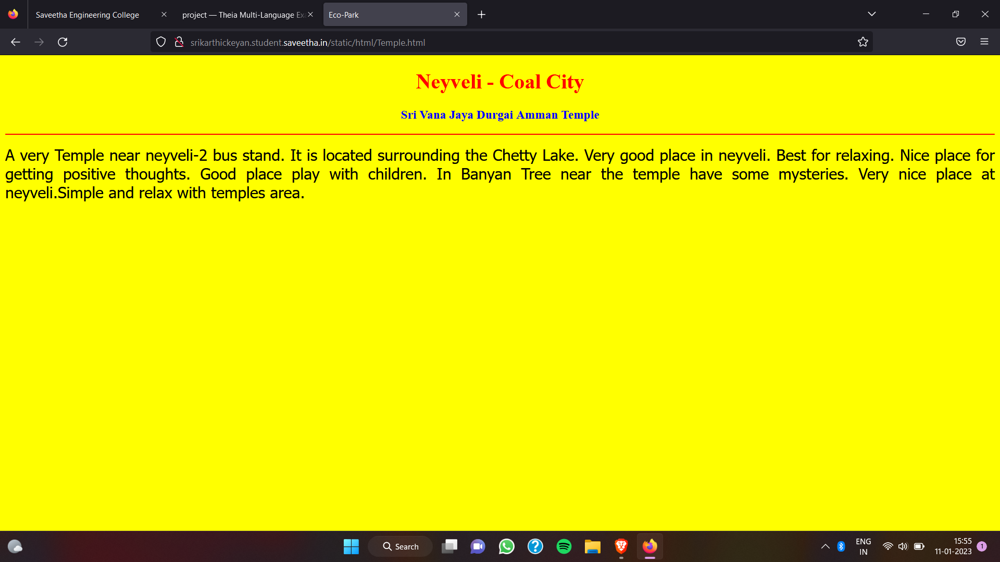

# Places Around Me
## AIM:
To develop a website to display details about the places around my house.

## Design Steps:

### Step 1:
Clone the github repository into Theia IDE
### Step 2:
Create a new django project
### Step 3:
Write the needed HTML code
### STEP 4:
Run the django server and execute the HTML files

## Code:
```
map.html

<!DOCTYPE html>
<html lang="en">
<head>
<title>My City</title>
</head>
<body>
<h1 align="center">
<font color="red"><b>Neyveli - Coal City</b></font>
</h1>
<h3 align="center">
<font color="blue"><b>Sri Karthickeyan Ganapathy (22008592)</b></font>
</h3>
<center>

<map name="MyCity">
<area shape="circle" coords="190,50,20" href="/static/html/SHM.html" title="Sacred Heart  Matriculation School">
<area shape="rectangle" coords="230,30,260,60" href="/static/html/NLC.html" title="NLC mines">
<area shape="circle" coords="400,350,50" href="/static/html/AL.html" title="Ayyanar Lake">
<area shape="circle" coords="400,200,75" href="/static/html/bus.html" title="Neyveli-2 Bus Stand">
<area shape="rectangle" coords="490,150,870,320" href="/static/html/Temple.html" title="Sri Vana Jaya Durgai Amman Temple">
</map>
</center>
</body>
</html>

bus.html

<!DOCTYPE html>
<html lang="en">
<head>
<title>Bus Stand</title>
</head>
<body bgcolor="cyan">
<h1 align="center">
<font color="red"><b>Neyveli - Coal City</b></font>
</h1>
<h3 align="center">
<font color="blue"><b>Neyveli-2  Bus Stand</b></font>
</h3>
<hr size="3" color="red">
<p align="justify">
<font face="Georgia" size="5">
<b>
Neyveli is a industrial town in the Cuddalore district in the Indian state of Tamil Nadu. It is located 62 kilometres (39 mi) inland from the Bay of Bengal, west of Pondicherry and 197 kilometres (122 mi) south of Chennai. The town was developed in 1956 after the establishment of Neyveli Lignite Corporation, a public sector enterprise.In 1935, the presence of black particles was discovered by Jambulinga Mudaliar. The analysis led to the discovery of lignite reserves beneath the areas in and around Neyveli village. The Neyveli Lignite Corporation was formed as a corporate Body in 1956 by the Government of India. The mining of lignite started in 1962. The first thermal power station was commissioned in 1962 with assistance from the U.S.S.R. 
</b>
</font>
</p>
</body>
</html>

NLC.html

<!DOCTYPE html>
<html lang="en">
<head>
<title>NLC mine</title>
</head>
<body bgcolor="pink">
<h1 align="center">
<font color="red"><b> Neyveli- Coal City</b></font>
</h1>
<h3 align="center">
<font color="blue"><b>NLC mine</b></font>
</h3>
<hr size="3" color="red">
<p align="justify">
<font face="Arial" size="5">
<b>
NLC Tamil Nadu Power Limited (NTPL), is a joint venture company of NLC India Ltd (formerly known as NLC Ltd) and TANGEDCO (Tamil Nadu Generation and Distribution Company), incorporated under the Companies Act. The Equity participation between NLC and TANGEDCO is 89:11. The Government of India had issued sanction for the implementation of coal-based 2 X 500MW thermal power project by NTPL at Tuticorin at an estimated cost of ₹ 4,909.54 crores, Unit 1 and Unit 2 has been declared for commercial operation effective 18 June 2015 and 29 August 2015. RCE – 2 for the project (Completion cost of the project) works out to ₹ 7,293.48 crores (June – 15 base). Power Purchase Agreement has been signed with TANGEDCO, ESCOMs of Karnataka, Puducherry Electricity Department, Kerala State Electricity Board and DISCOMs of Andhra Pradesh. Power evacuation from this project is being carried out by Power Grid Corporation of India. NTPL has signed a fuel supply agreement with Mahanadhi Coalfields for supply of 3.0 MTPA of coal and to meet the shortfall in the requirement, a contract has also been awarded on MSTC for the supply of imported coal.
</b>

</font>
</p>
</body>
</html>

SHM.html

<!DOCTYPE html>
<html lang="en">
<head>
<title>Sacred Heart  Matriculation School</title>
</head>
<body bgcolor="lime">
<h1 align="center">
<font color="red"><b>Neyveli - Coal City</b></font>
</h1>
<h3 align="center">
<font color="blue"><b>Sacred Heart  Matriculation School</b></font>
</h3>
<hr size="3" color="red">
<p align="justify">
<font face="Georgia" size="5">
The main objectives of Neyveli’s Sacred Heart  Matriculation School  are
<ul>
<li>To impart proper and qualified training to teachers and give them an attractive salary and incentives so that they are not tempted to quit and look elsewhere for jobs.</li>
<li>To provide financial aids and grants wisely and judiciously.</li>
<li>To Frame of syllabus and curriculum.</li>
<li>To set aims and objectives of education.</li>
</ul>
</font>
</p>
</body>
</html>

Temple.html

<!DOCTYPE html>
<html lang="en">
<head>
<title>Eco-Park</title>
</head>
<body bgcolor="yellow">
<h1 align="center">
<font color="red"><b>Neyveli - Coal City</b></font>
</h1>
<h3 align="center">
<font color="blue"><b>Sri Vana Jaya Durgai Amman Temple</b></font>
</h3>
<hr size="3" color="red">
<p align="justify">
<font face="Tahoma" size="5">
A very Temple near neyveli-2 bus stand. It is located surrounding the Chetty Lake. 
Very good place in neyveli. Best for relaxing. Nice place for getting positive thoughts.
Good place play with children.  In Banyan Tree near the temple have some mysteries.
Very nice place at neyveli.Simple and relax with temples area.
</font>
</p>
</body>
</html>

AL.html

<!DOCTYPE html>
<html lang="en">
<head>
<title>Ayyanar Lake</title>
</head>
<body bgcolor="orange">
<h1 align="center">
<font color="red"><b>Neyveli- Coal City</b></font>
</h1>
<h3 align="center">
<font color="blue"><b>Ayyanar Lake</b></font>
</h3>
<hr size="3" color="red">
<p align="justify">
<font face="Georgia" size="5">
The uses of Ayyanar Lake in Neyveli are 
<ol type="1">
<li>Lake is used for rain water harvesting.</li>
<li>It is used for drinking.</li>
<li>Pisculture.</li>
<li>For bathing, washing clothes etc.</li>
</ol>
</font>
</p>
</body>
</html>
```

## Output:





## HTML Validator:


## Result:
The program for implementing image map is executed successfully